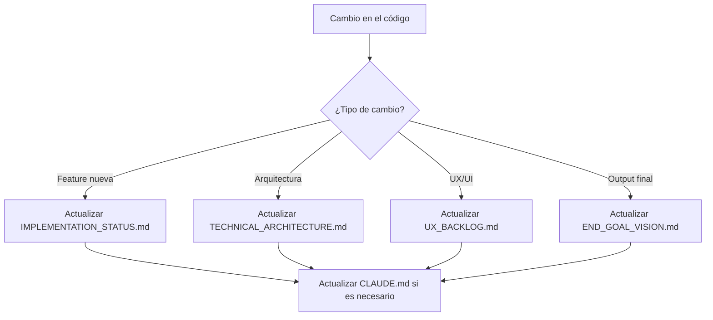

# 📚 CLAUDE.md - KIKI REFACTORIZADO

> **Sistema transformado completamente**. KIKI es ahora un **distribuidor de system prompts profesionales** con wizard pedagógico.

## 🎯 Propósito del Sistema Refactorizado

**KIKI** es ahora:
1. **Distribuidor de prompts enterprise-grade** - System prompts profesionales desde archivos .md
2. **Plataforma pedagógica** - Enseña conceptos de desarrollo (Design Thinking, DDD, MONOREPO, DevOps)
3. **Sistema multi-AI** - Compatible con ChatGPT, Claude, Perplexity, Gemini
4. **Arquitectura simple** - localStorage + API de prompts + copy-to-clipboard

## 🔄 TRANSFORMACIÓN COMPLETADA

### **ELIMINADO (Sistema Problemático)**
- ❌ AI chat interno con personas (Peter, Sara, Tony, Chris, Quentin)
- ❌ Database compleja con foreign key constraint errors
- ❌ Dependencias de AI providers (DeepSeek, etc.)
- ❌ Sistema sobrecomplejo de chat y mensajes

### **IMPLEMENTADO (Sistema Simple y Funcional)**
- ✅ **System prompts dinámicos** - Carga desde `/System Prompts/` real
- ✅ **Copy-to-clipboard workflow** - Usuario copia → usa en su AI → retorna URL
- ✅ **Wizard pedagógico** - Cada paso enseña conceptos específicos
- ✅ **localStorage tracking** - Simple, sin foreign keys
- ✅ **UI diferenciada** - Pasos 1-3 (chat), Pasos 4-5 (IDE work)
- ✅ **neobrutalism.dev design** - Borders negros, shadows, font-mono conservado

---

## 📖 Documentación Principal

### 1. README.md
- **Ubicación**: `/README.md`
- **Propósito**: Introducción general del proyecto
- **Actualizar cuando**: Cambien features principales o requisitos
- **Contenido clave**: Qué es KIKI, cómo instalarlo, primeros pasos

### 2. END_GOAL_VISION.md ⭐
- **Ubicación**: `/docs/END_GOAL_VISION.md`
- **Propósito**: Define qué obtiene el usuario al completar el wizard
- **Actualizar cuando**: Se agreguen nuevas características al output final
- **Contenido clave**: Los 4 pilares de valor que entrega KIKI

---

## 🏗️ Documentación Técnica

### 3. TECHNICAL_ARCHITECTURE.md
- **Ubicación**: `/docs/TECHNICAL_ARCHITECTURE.md`
- **Propósito**: Arquitectura completa del sistema
- **Actualizar cuando**: Cambios en la estructura o tecnologías
- **Contenido clave**: Stack, flujo de datos, decisiones técnicas

### 4. SKELETON_GENERATION_SYSTEM.md
- **Ubicación**: `/docs/SKELETON_GENERATION_SYSTEM.md`
- **Propósito**: Sistema de generación de proyectos
- **Actualizar cuando**: Se modifiquen templates o lógica de generación
- **Contenido clave**: Cómo KIKI genera los proyectos starter

### 5. MCP_INTEGRATION_STRATEGY.md
- **Ubicación**: `/docs/MCP_INTEGRATION_STRATEGY.md`
- **Propósito**: Estrategia de integración con Model Context Protocol
- **Actualizar cuando**: Se agreguen nuevos MCPs o cambien integraciones
- **Contenido clave**: MCPs usados, configuración, casos de uso

### 6. DEEPSEEK_CONFIGURATION.md
- **Ubicación**: `/DEEPSEEK_CONFIGURATION.md`
- **Propósito**: Configuración del proveedor de IA principal
- **Actualizar cuando**: Cambios en prompts o configuración de IA
- **Contenido clave**: API keys, prompts, fallback strategy

### 7. TECH_STACK_RECOMMENDATIONS.md
- **Ubicación**: `/docs/TECH_STACK_RECOMMENDATIONS.md`
- **Propósito**: Recomendaciones de tecnologías por tipo de proyecto
- **Actualizar cuando**: Se agreguen nuevas tecnologías soportadas
- **Contenido clave**: Matrices de decisión tecnológica

---

## 👤 Documentación de Producto

### 8. PROJECT_OVERVIEW.md
- **Ubicación**: `/docs/PROJECT_OVERVIEW.md`
- **Propósito**: Visión general del producto y roadmap
- **Actualizar cuando**: Cambios en la visión o hitos alcanzados
- **Contenido clave**: Misión, visión, fases del proyecto

### 9. KIKI_PERSONALITY.md
- **Ubicación**: `/docs/KIKI_PERSONALITY.md`
- **Propósito**: Define la personalidad y tono de KIKI
- **Actualizar cuando**: Ajustes en la experiencia de usuario
- **Contenido clave**: Tono, estilo, principios de comunicación

### 10. UX_EVALUATION_REPORT.md
- **Ubicación**: `/docs/UX_EVALUATION_REPORT.md`
- **Propósito**: Evaluación de la experiencia de usuario actual
- **Actualizar cuando**: Después de cada ronda de user testing
- **Contenido clave**: Problemas encontrados, mejoras sugeridas

### 11. UX_BACKLOG.md
- **Ubicación**: `/docs/UX_BACKLOG.md`
- **Propósito**: Lista priorizada de mejoras de UX pendientes
- **Actualizar cuando**: Se completen mejoras o surjan nuevas necesidades
- **Contenido clave**: Mejoras priorizadas, estimaciones

---

## 🚀 Documentación de Desarrollo

### 12. DEVELOPMENT_SETUP.md
- **Ubicación**: `/docs/DEVELOPMENT_SETUP.md`
- **Propósito**: Guía para contribuidores al proyecto
- **Actualizar cuando**: Cambien dependencias o proceso de setup
- **Contenido clave**: Requisitos, instalación, configuración local

### 13. IMPLEMENTATION_STATUS.md
- **Ubicación**: `/IMPLEMENTATION_STATUS.md`
- **Propósito**: Estado actual de implementación
- **Actualizar cuando**: Se completen features o cambien prioridades
- **Contenido clave**: Features completadas, en progreso, pendientes

### 14. STRUCTURE_SUMMARY.md
- **Ubicación**: `/STRUCTURE_SUMMARY.md`
- **Propósito**: Resumen de la estructura de archivos
- **Actualizar cuando**: Cambios significativos en la organización
- **Contenido clave**: Árbol de directorios, propósito de cada carpeta

---

## 📊 Reportes y Estados

### 15. Reportes de Testing
- **TEST_REPORT.md**: Reporte general de tests
- **PLAYWRIGHT_DEMO_REPORT.md**: Reporte de tests E2E
- **PHASE3_TEST_REPORT.md**: Tests específicos de la fase 3
- **Actualizar**: Después de cada sesión de testing significativa

### 16. Reportes de Fases
- **PHASE3_FINAL_REPORT.md**: Reporte final de la fase 3
- **README_PHASE3_STATUS.md**: Estado específico de la fase 3
- **Actualizar**: Al completar cada fase del proyecto

### 17. CLOUD_MIGRATION_SUMMARY.md
- **Ubicación**: `/CLOUD_MIGRATION_SUMMARY.md`
- **Propósito**: Resumen de la migración a servicios cloud
- **Actualizar cuando**: Cambios en infraestructura cloud
- **Contenido clave**: Servicios migrados, configuración

### 18. DOCS_OVERVIEW.md
- **Ubicación**: `/docs/DOCS_OVERVIEW.md`
- **Propósito**: Documentación extensa para usuarios y desarrolladores
- **Actualizar cuando**: Nuevas features o cambios en el flujo de usuario
- **Contenido clave**: Guías detalladas, tutoriales, FAQ

---

## 🔧 Mantenimiento de la Documentación

### Jerarquía de Importancia

1. **🔴 Críticos** (actualizar inmediatamente):
   - CLAUDE.md (este archivo)
   - END_GOAL_VISION.md
   - TECHNICAL_ARCHITECTURE.md
   - README.md

2. **🟡 Importantes** (actualizar semanalmente):
   - IMPLEMENTATION_STATUS.md
   - DEVELOPMENT_SETUP.md
   - UX_BACKLOG.md

3. **🟢 Informativos** (actualizar mensualmente):
   - Reportes de testing
   - Reportes de fases
   - Documentación de configuración

### Flujo de Actualización



### Comandos Claude Code para Documentación

```bash
# Actualizar estado general
/update-docs --status

# Generar reporte de testing
/generate-test-report

# Actualizar documentación técnica
/update-technical-docs

# Sincronizar este archivo con cambios
/sync-claude-md
```

---

## 📝 Notas para Claude Code y Asistentes IA

Cuando trabajes en el proyecto KIKI:

1. **Siempre consulta este archivo primero** para entender la estructura
2. **Verifica END_GOAL_VISION.md** para alinear cualquier cambio con los objetivos
3. **Actualiza IMPLEMENTATION_STATUS.md** después de cambios significativos
4. **Mantén la coherencia** entre todos los documentos referenciados

### Contexto Esencial para IA

- **Proyecto**: KIKI - Wizard para crear proyectos con metodología Vibe Coding
- **Objetivo**: Entregar un proyecto completo, configurado y educativo
- **Tecnologías clave**: Next.js, Supabase, TypeScript, MCPs
- **Metodología**: Vibe Coding con Claude Code
- **Usuario target**: Desarrolladores que quieren arrancar rápido con buenas prácticas

---

## 🚨 Gestión de Documentos Obsoletos

### Documentos Archivados
Se ha creado la carpeta `/docs/archive/` para documentos históricos. Los siguientes documentos han sido movidos:

1. **README_PHASE3_STATUS.md** - Estado específico de fase 3 (archivado)
2. **PHASE3_TEST_REPORT.md** - Reporte de tests de fase 3 (archivado)
3. **PHASE3_FINAL_REPORT.md** - Reporte final de fase 3 (archivado)

### Política de Archivado
- Documentos específicos de fases completadas → `/docs/archive/`
- Reportes de test antiguos → Consolidar en TEST_REPORT.md principal
- Documentación temporal → Eliminar después de 30 días si no es relevante

---

_Última actualización: 22 de Enero de 2025_
_Siguiente revisión programada: 29 de Enero de 2025_