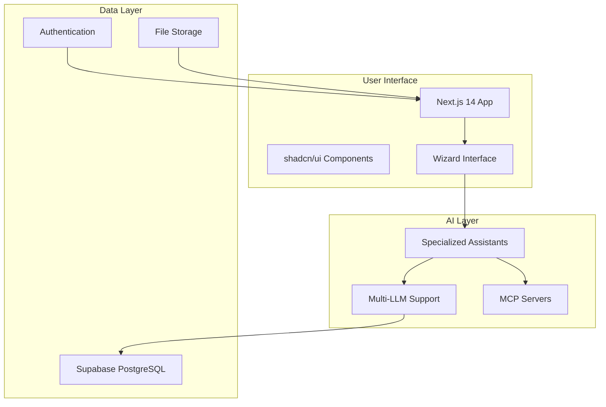

# 📚 Kiki Platform Documentation

Welcome to the comprehensive documentation for the **Kiki Platform** - an AI-powered educational platform that transforms project ideas into development-ready structures using the Vibe Coding methodology.

## 📖 Documentation Overview

This documentation provides everything you need to understand, develop, deploy, and contribute to the Kiki platform.

### Quick Navigation

| Document | Purpose | Audience |
|----------|---------|----------|
| **[Project Overview](./PROJECT_OVERVIEW.md)** | High-level platform understanding | Everyone |
| **[Technical Architecture](./TECHNICAL_ARCHITECTURE.md)** | System design and component structure | Developers, Architects |
| **[Development Setup](./DEVELOPMENT_SETUP.md)** | Local development environment | Developers |
| **[MCP Integration Strategy](./MCP_INTEGRATION_STRATEGY.md)** | External AI service integration | Developers, DevOps |

## 🚀 Quick Start

### For Developers
1. **Read**: [Development Setup Guide](./DEVELOPMENT_SETUP.md)
2. **Clone**: Repository and install dependencies
3. **Configure**: Environment variables and services
4. **Run**: `npm run dev` to start development server

### For Product Managers
1. **Read**: [Project Overview](./PROJECT_OVERVIEW.md)
2. **Understand**: User journey and business value
3. **Review**: Success metrics and roadmap

### For Architects
1. **Read**: [Technical Architecture](./TECHNICAL_ARCHITECTURE.md)
2. **Review**: System design and scalability considerations
3. **Evaluate**: MCP integration patterns and security model

## 🎯 What is Kiki?

Kiki is an innovative educational platform that bridges the gap between great ideas and successful software projects. It guides non-technical entrepreneurs and students through a structured, AI-assisted process to create comprehensive project specifications, technical documentation, and development-ready structures.

### Key Benefits
- **Zero Technical Barrier**: No coding experience required
- **Educational Focus**: Learn while creating your project
- **Complete Output**: Fully structured project with documentation
- **AI-Powered Guidance**: Specialized assistants for each phase
- **Industry Standards**: Following best practices and modern methodologies

## 🏗️ Architecture Overview



## 🌊 The Vibe Coding Journey

### 5-Phase Wizard Process

1. **🎯 Conceptualization**
   - Define project vision and goals
   - Identify target users and MVP features
   - *AI Assistant: Peter (Project Mentor)*

2. **🔍 Research & Validation**
   - Market analysis and competitor research
   - Technology landscape exploration
   - *AI Assistant: Sara (Market Researcher)*

3. **🛠️ Technical Planning**
   - Architecture design and tech stack selection
   - Environment setup and MCP configuration
   - *AI Assistant: Tony (Technical Architect)*

4. **📄 Document Generation**
   - PRD, user stories, and technical documentation
   - CLAUDE.md and development workflows
   - *AI Assistant: Chris (Technical Writer)*

5. **📦 Setup & Export**
   - Final configuration and project export
   - Next steps and development guidance
   - *AI Assistant: Quentin (DevOps Coach)*

## 🤖 AI-Powered Features

### Multi-LLM Support
- **Claude**: Primary reasoning and analysis
- **OpenAI**: Alternative processing and generation
- **Gemini**: Specialized tasks and fallback
- **DeepSeek & Qwen**: Cost-effective options

### MCP Server Integration
- **Magic MCP**: UI component generation using 21st.dev
- **Context7**: Live documentation and best practices
- **Sequential**: Complex multi-step reasoning
- **Playwright**: Testing and validation

### Specialized AI Assistants
Each wizard phase features a dedicated AI assistant with specialized knowledge, personality, and educational focus tailored to that phase's objectives.

## 📊 Success Metrics

### Primary KPIs
- **85%+** project completion rate
- **<30 minutes** average time per phase
- **95%+** user satisfaction score
- **80%+** successful project exports

### Educational Impact
- Comprehensive learning through doing
- Real-world project experience
- Industry-standard methodology exposure
- Confidence building for non-technical users

## 🔧 Technology Stack

### Frontend
- **Next.js 14** with App Router
- **TypeScript** for type safety
- **shadcn/ui** component library
- **Tailwind CSS** for styling
- **Zustand** for state management

### Backend
- **Supabase** as Backend-as-a-Service
- **PostgreSQL** database
- **Row Level Security** for data protection
- **Edge Functions** for AI processing

### AI & Integration
- **Multi-provider AI** support
- **MCP servers** for specialized capabilities
- **Streaming responses** for real-time interaction
- **Intelligent fallbacks** for reliability

## 🚀 Getting Started

### Prerequisites
- Node.js 18.17+
- npm or yarn
- Supabase account
- At least one AI provider API key

### Quick Setup
```bash
# Clone repository
git clone <repository-url>
cd kiki

# Install dependencies
npm install

# Configure environment
cp .env.example .env.local
# Edit .env.local with your API keys

# Setup database
npm run db:migrate

# Start development
npm run dev
```

### Next Steps
1. Visit http://localhost:3000
2. Create an account
3. Start your first project
4. Experience the wizard journey

## 📚 Learning Resources

### For Users
- **In-App Tutorials**: Built into the wizard experience
- **Video Walkthroughs**: Step-by-step guidance
- **Community Forum**: User discussions and support

### For Developers
- **API Documentation**: Complete endpoint reference
- **Component Library**: shadcn/ui component usage
- **MCP Integration**: External service connection patterns
- **Testing Guide**: Unit and E2E testing strategies

## 🤝 Contributing

We welcome contributions from the community! Here's how you can help:

### Development Contributions
1. Fork the repository
2. Create a feature branch
3. Follow our coding standards
4. Add tests for new functionality
5. Submit a pull request

### Documentation Improvements
- Clarify existing documentation
- Add examples and use cases
- Translate to other languages
- Create video tutorials

### Community Support
- Help users in the forum
- Report bugs and issues
- Suggest new features
- Share success stories

## 📞 Support & Community

### Getting Help
- **Technical Issues**: Create GitHub issue
- **Feature Requests**: Use GitHub discussions
- **General Questions**: Community forum
- **Security Issues**: security@kiki-platform.com

### Community Channels
- **GitHub**: Source code and issues
- **Discord**: Real-time community chat
- **Twitter**: Updates and announcements
- **LinkedIn**: Professional networking

## 📈 Roadmap

### Q1 2025
- [ ] Core wizard functionality
- [ ] Basic MCP integration
- [ ] User authentication and projects

### Q2 2025
- [ ] Advanced AI features
- [ ] Enhanced MCP servers
- [ ] Admin panel and analytics

### Q3 2025
- [ ] Multi-language support
- [ ] Advanced export options
- [ ] Enterprise features

### Q4 2025
- [ ] Mobile application
- [ ] Offline capabilities
- [ ] Advanced collaboration tools

## 📄 License & Legal

### Open Source License
This project is released under the MIT License. See [LICENSE](../LICENSE) file for details.

### Privacy & Terms
- **Privacy Policy**: How we handle user data
- **Terms of Service**: Usage terms and conditions
- **Cookie Policy**: Cookie usage and preferences

### Third-Party Services
- **AI Providers**: Claude, OpenAI, Gemini terms apply
- **Supabase**: Database and auth service terms
- **Vercel**: Hosting and deployment terms

---

## 🎉 Thank You

Thank you for your interest in the Kiki platform! Whether you're a user looking to bring your ideas to life, a developer contributing to the codebase, or an educator using our platform, you're part of our mission to democratize software project creation.

**Happy Building! 🚀**

---

*This documentation is continuously updated. Last revision: January 2025*
*For the most current information, please check our GitHub repository.*