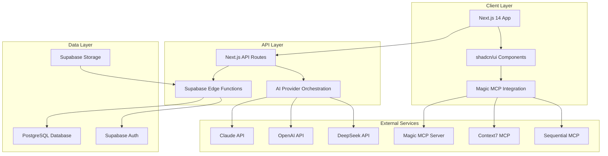

# 🏗️ Technical Architecture Documentation

## System Architecture Overview

The Kiki platform follows a modern, scalable architecture pattern combining JAMstack principles with AI-powered backend services.



## Component Architecture

### Frontend Architecture

#### Next.js 14 App Router Structure
```typescript
app/
├── (auth)/                 # Authentication routes
│   ├── login/
│   └── signup/
├── (dashboard)/           # Protected dashboard routes
│   ├── projects/
│   └── settings/
├── wizard/               # Main wizard flow
│   └── [projectId]/
│       ├── concept/
│       ├── research/
│       ├── planning/
│       ├── generate/
│       └── export/
├── admin/               # Admin panel routes
│   ├── users/
│   └── analytics/
└── api/                # API endpoints
    ├── ai/
    ├── chat/
    └── projects/
```

#### Component Hierarchy
```typescript
// Core UI Components (shadcn/ui based)
components/
├── ui/                  # Base shadcn/ui components
│   ├── button.tsx
│   ├── card.tsx
│   ├── input.tsx
│   └── ...
├── wizard/             # Wizard-specific components
│   ├── ChatInterface.tsx
│   ├── PhaseNavigation.tsx
│   ├── ProgressStepper.tsx
│   └── phases/
│       ├── ConceptPhase.tsx
│       ├── ResearchPhase.tsx
│       └── ...
├── dashboard/          # Dashboard components
│   ├── ProjectGrid.tsx
│   ├── StatCards.tsx
│   └── ...
└── admin/             # Admin components
    ├── UserTable.tsx
    ├── Analytics.tsx
    └── ...
```

### Backend Architecture

#### Supabase Integration
```typescript
// Database Schema
interface DatabaseSchema {
  kiki_users: UserProfile
  kiki_projects: Project
  kiki_project_phases: ProjectPhase
  kiki_ai_conversations: AIConversation
  kiki_documents: GeneratedDocument
  kiki_checklist_items: ChecklistItem
  kiki_admin_settings: AdminSetting
  kiki_usage_stats: UsageStats
}

// Row Level Security Policies
const RLSPolicies = {
  kiki_users: "Users can only access their own profile",
  kiki_projects: "Users can only access their own projects",
  kiki_project_phases: "Users can only access phases of their projects",
  kiki_ai_conversations: "Users can only access their conversations",
  kiki_documents: "Users can only access their documents"
}
```

#### AI Provider Architecture
```typescript
// Multi-provider AI system
interface AIProvider {
  name: string
  apiKey: string
  models: string[]
  endpoint: string
  rateLimits: {
    requestsPerMinute: number
    tokensPerMinute: number
  }
}

// Provider orchestration
class AIOrchestrator {
  private providers: Map<string, AIProvider>
  
  async chat(
    provider: string,
    messages: ChatMessage[],
    context: ProjectContext
  ): Promise<ChatResponse>
  
  async generateDocument(
    template: DocumentTemplate,
    data: ProjectData
  ): Promise<GeneratedDocument>
}
```

### MCP Server Integration

#### Magic MCP (UI Generation)
```typescript
// Magic MCP Integration for UI Components
interface MagicMCPClient {
  searchComponents(query: string): Promise<ComponentResult[]>
  generateComponent(
    specification: ComponentSpec
  ): Promise<GeneratedComponent>
  refineComponent(
    component: string,
    feedback: string
  ): Promise<RefinedComponent>
}

// Usage in wizard
const generateWizardStep = async (phase: WizardPhase) => {
  const componentSpec = {
    type: 'form',
    fields: phase.fields,
    validation: phase.validation,
    styling: 'modern-card'
  }
  
  return await magicMCP.generateComponent(componentSpec)
}
```

#### Context7 (Documentation & Patterns)
```typescript
// Context7 integration for best practices
interface Context7Client {
  resolveLibraryId(libraryName: string): Promise<string>
  getLibraryDocs(
    libraryId: string,
    topic?: string
  ): Promise<Documentation>
}

// Usage for tech stack guidance
const getTechStackGuidance = async (stack: TechStack) => {
  const patterns = await Promise.all(
    stack.libraries.map(lib => 
      context7.getLibraryDocs(lib, 'getting-started')
    )
  )
  return patterns
}
```

#### Sequential MCP (Complex Analysis)
```typescript
// Sequential thinking for complex decisions
interface SequentialClient {
  analyze(
    problem: string,
    context: any,
    options: AnalysisOptions
  ): Promise<StructuredAnalysis>
}

// Usage in architecture planning
const analyzeArchitecture = async (requirements: ProjectRequirements) => {
  return await sequential.analyze(
    'Design optimal architecture for SaaS application',
    requirements,
    { depth: 'comprehensive', focus: ['scalability', 'maintainability'] }
  )
}
```

## Data Flow Architecture

### Wizard State Management
```typescript
// Zustand store for wizard state
interface WizardState {
  projectId: string
  currentPhase: Phase
  phaseData: Record<Phase, any>
  chatHistory: ChatMessage[]
  isLoading: boolean
  
  // Actions
  setPhase: (phase: Phase) => void
  updatePhaseData: (phase: Phase, data: any) => void
  addChatMessage: (message: ChatMessage) => void
  saveProgress: () => Promise<void>
}

// Persistence strategy
const persistenceMiddleware = (set, get) => ({
  ...get(),
  saveProgress: async () => {
    const state = get()
    
    // Save to localStorage for offline resilience
    localStorage.setItem('wizard-state', JSON.stringify(state))
    
    // Save to Supabase for cross-device sync
    await supabase
      .from('kiki_project_phases')
      .upsert({
        project_id: state.projectId,
        phase_name: state.currentPhase,
        data: state.phaseData[state.currentPhase],
        chat_history: state.chatHistory
      })
  }
})
```

### Real-time Chat Architecture
```typescript
// Streaming chat implementation
interface ChatStream {
  async *chatCompletion(
    messages: ChatMessage[],
    provider: AIProvider
  ): AsyncGenerator<string, void, unknown> {
    const response = await fetch(`/api/ai/chat`, {
      method: 'POST',
      body: JSON.stringify({ messages, provider }),
      headers: { 'Content-Type': 'application/json' }
    })
    
    const reader = response.body?.getReader()
    const decoder = new TextDecoder()
    
    while (true) {
      const { done, value } = await reader.read()
      if (done) break
      
      const chunk = decoder.decode(value)
      const lines = chunk.split('\n')
      
      for (const line of lines) {
        if (line.startsWith('data: ')) {
          const data = JSON.parse(line.slice(6))
          if (data.content) yield data.content
        }
      }
    }
  }
}
```

## Security Architecture

### Authentication & Authorization
```typescript
// Multi-layer security model
interface SecurityModel {
  authentication: 'supabase-auth'
  authorization: 'row-level-security'
  apiSecurity: 'rate-limiting' | 'api-keys' | 'cors'
  dataProtection: 'encryption-at-rest' | 'encryption-in-transit'
}

// RLS Policy Examples
const createRLSPolicies = () => `
  -- Users can only access their own projects
  CREATE POLICY "Users can access own projects" ON kiki_projects
  FOR ALL USING (auth.uid() = user_id);
  
  -- Admins can access all data
  CREATE POLICY "Admins can access all" ON kiki_projects
  FOR ALL USING (
    EXISTS (
      SELECT 1 FROM kiki_users 
      WHERE id = auth.uid() AND role = 'admin'
    )
  );
`
```

### API Security
```typescript
// Rate limiting middleware
const rateLimitMiddleware = rateLimit({
  windowMs: 15 * 60 * 1000, // 15 minutes
  max: 100, // Limit each IP to 100 requests per windowMs
  message: 'Too many requests from this IP',
  standardHeaders: true,
  legacyHeaders: false,
})

// API key validation
const validateAPIKey = async (req: Request) => {
  const apiKey = req.headers.get('authorization')
  if (!apiKey) throw new Error('Missing API key')
  
  const isValid = await supabase
    .from('api_keys')
    .select('*')
    .eq('key', apiKey)
    .eq('active', true)
    .single()
    
  return isValid.data !== null
}
```

## Performance Architecture

### Optimization Strategies
```typescript
// Performance optimization configuration
interface PerformanceConfig {
  // Frontend optimizations
  bundleSplitting: {
    vendor: string[]
    pages: 'automatic'
    components: 'dynamic'
  }
  
  // Caching strategy
  caching: {
    static: '1y'
    api: '5m'
    images: '30d'
    documents: '1d'
  }
  
  // Database optimizations
  database: {
    indexing: 'auto'
    pooling: 'enabled'
    caching: 'redis'
  }
}

// Lazy loading implementation
const LazyWizardPhase = dynamic(
  () => import(`./phases/${phaseName}Phase`),
  {
    loading: () => <PhaseLoadingSkeleton />,
    ssr: false
  }
)
```

### Monitoring & Observability
```typescript
// Application monitoring setup
interface MonitoringConfig {
  errorTracking: 'sentry'
  analytics: 'posthog'
  performance: 'web-vitals'
  logging: 'structured-json'
}

// Custom metrics collection
const trackUserAction = (action: string, metadata: any) => {
  // PostHog tracking
  posthog.capture(action, metadata)
  
  // Custom database logging
  supabase.from('kiki_usage_stats').insert({
    action,
    metadata,
    user_id: auth.user?.id,
    timestamp: new Date().toISOString()
  })
}
```

## Deployment Architecture

### Vercel + Supabase Setup
```typescript
// Deployment configuration
interface DeploymentConfig {
  frontend: {
    platform: 'vercel'
    regions: ['us-east-1', 'eu-west-1']
    environment: 'serverless'
  }
  
  backend: {
    platform: 'supabase'
    database: 'postgresql'
    functions: 'edge-runtime'
    storage: 's3-compatible'
  }
  
  cdn: {
    provider: 'vercel-cdn'
    caching: 'aggressive'
    compression: 'gzip-brotli'
  }
}

// Environment configuration
const environmentConfig = {
  development: {
    database: 'local-supabase',
    ai: 'rate-limited',
    logging: 'verbose'
  },
  
  staging: {
    database: 'supabase-staging',
    ai: 'shared-quota',
    logging: 'structured'
  },
  
  production: {
    database: 'supabase-production',
    ai: 'dedicated-quota',
    logging: 'minimal'
  }
}
```

---

*This technical architecture documentation provides a comprehensive overview of the system design, component interactions, and implementation strategies for the Kiki platform. Last updated: January 2025*